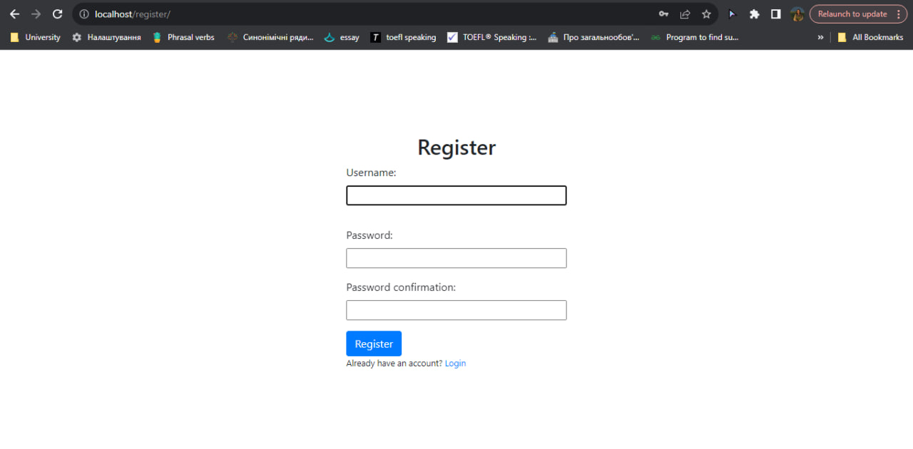
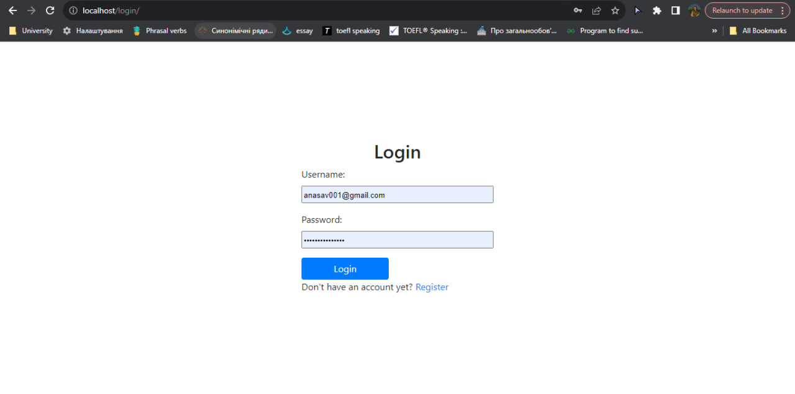
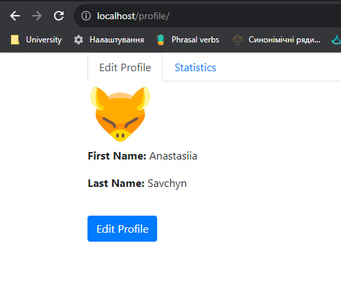
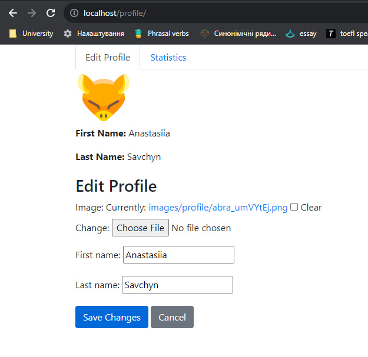
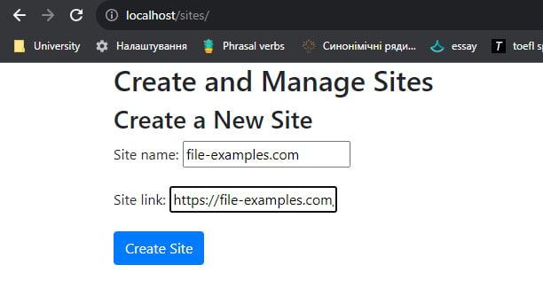
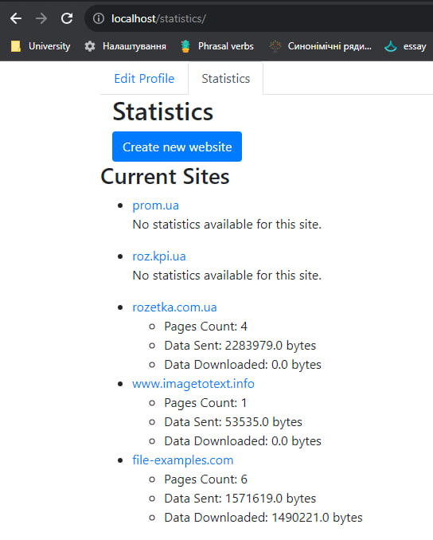
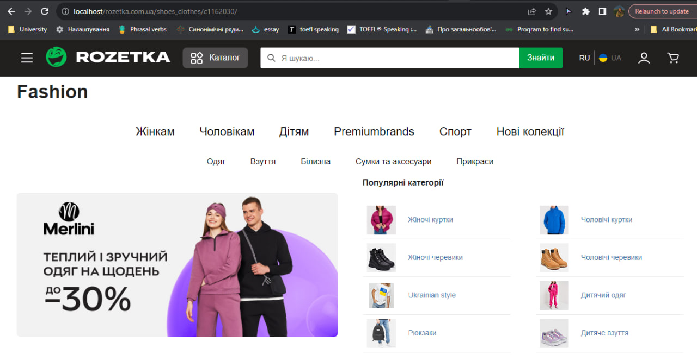

### VPN test app

To run (master branch)  

- docker-compose up --build

To migrate from terminal if needed (Open one more):

- docker exec -it app_vpn python manage.py migrate

# Auth flow

# Edit profile

# Create site flow

# Example

